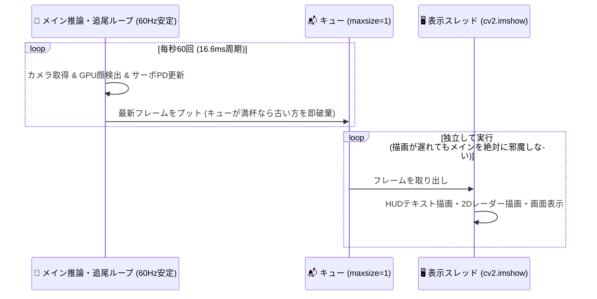
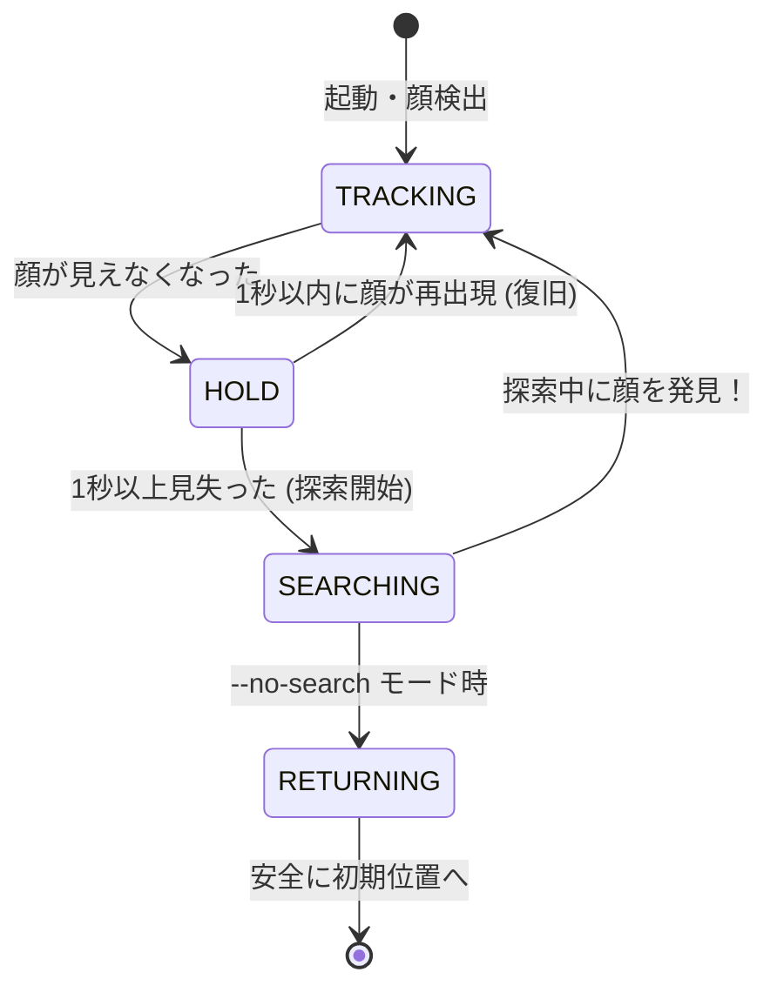

# Jetson Nano × MediaPipe<br>60 FPS リアルタイム顔追尾システム
### エッジAI・非同期プログラミング・制御工学の実践入門

**対象：** PythonやC言語の基礎に少し触れたことがある大学生  
**スクリプト：** `face_tracker_mediapipe.py`

---

## 1. このシステムは何をしているのか？

人間の顔をカメラで見つけ、**60 FPS（1秒間に60回）** の滑らかさでカメラを乗せた2軸サーボモータ（首振りロボット）が視線を追従し続けるシステムです。

<div class="box-grid">
  <div class="card">
    <h3>👀 みる（画像認識）</h3>
    <ul>
      <li>CSIカメラから映像をキャプチャ</li>
      <li>AI（MediaPipe）が顔の位置・鼻の座標を特定</li>
      <li>画面中央からの「ズレ（誤差）」を計算</li>
    </ul>
  </div>
  <div class="card">
    <h3>🤖 うごく（制御工学）</h3>
    <ul>
      <li>PD制御でモータの適切なスピードを計算</li>
      <li>左右（Pan）と上下（Tilt）のサーボを駆動</li>
      <li>顔を見失ったら周囲を自動で見渡して捜索</li>
    </ul>
  </div>
</div>

<div class="highlight">
  <strong>ポイント：</strong> 単にAIを動かすだけでなく、<strong>「画像認識」「並列処理」「ハードウェア制御」</strong> を1本のスクリプトでシームレスに結合させています。
</div>

---

## 2. ハードウェアの全体構成

小型コンピュータ **Jetson Nano** を頭脳として、カメラとモータが繋がっています。

```mermaid
flowchart LR
    A["🎥 CSIカメラ<br>(Sony IMX219)"] -->|MIPI-CSI高速伝送| B["🧠 NVIDIA Jetson Nano<br>(Tegra GPU搭載)"]
    B -->|I2C通信 (0x40)| C["⚡ PCA9685<br>(PWMドライバ基板)"]
    C -->|CH0: 水平パルス| D["↔️ Pan サーボ (水平)"]
    C -->|CH1: 垂直パルス| E["↕️ Tilt サーボ (垂直)"]
```

* **Jetson Nano:** 128基のNVIDIA Maxwell GPUコアを搭載した小型シングルボードPC。
* **CSIカメラ:** USB接続と異なり、GPUメモリ（NVMM）へ直接DMA転送できる超高速カメラ。
* **PCA9685:** CPUに負荷をかけず、指定した角度のパルス信号（PWM）を出し続ける専用IC。

---

## 3. なぜ普通のコードでは 60 FPS が出ないのか？

大学の実験などでよくある「初心者向けPythonループ」をそのまま動かすと…

```python
# 初心者がやりがちな同期ループ（10〜15 FPSでカクカク）
while True:
    ret, frame = cap.read()       # ① カメラ待機 (16ms)
    faces = model.detect(frame)   # ② AI推論 (CPUだと50〜100ms)
    servo.set_angle(...)          # ③ モータ通信 (5ms)
    cv2.imshow("Window", frame)   # ④ 画面描画 (15〜25ms: 超重い！)
    cv2.waitKey(1)
```

### 3大ボトルネック
1. **CPUでの重いAI推論:** 画像の全ピクセル演算でCPUがパンクする。
2. **描画（GUI）のブロッキング:** `cv2.imshow` やフォント描画はX11ウィンドウシステムを同期待機するため、追従ループが止まる。
3. **データコピーの無駄:** メインメモリとGPUメモリ間で画像を何度も往復させてしまう。

---

## 4. 解決策①：MediaPipe & GPUデリゲート

本スクリプトでは、Googleが開発した軽量顔検出モデル **BlazeFace** を **OpenGL ES GPUデリゲート** で実行しています。

<div class="box-grid">
  <div class="card">
    <h3>CPU推論（従来）</h3>
    <ul>
      <li>1フレームの推論に 40〜80 ms</li>
      <li>最大でも 12〜20 FPS 程度</li>
      <li>Jetson Nanoの4コアCPUが100%に張り付く</li>
    </ul>
  </div>
  <div class="card">
    <h3>GPUデリゲート（本コード）</h3>
    <ul>
      <li>1フレームの推論が <strong>約 8.5 ms！</strong></li>
      <li>余裕の <strong>60 FPS</strong> リアルタイム処理</li>
      <li>GPUの超並列シェーダで高速演算</li>
    </ul>
  </div>
</div>

```python
# GStreamerハードウェアパイプライン (nvvidconvでGPU内で縮小 & 双線形補間)
csi_pipeline = (
    "nvarguscamerasrc ! "
    "video/x-raw(memory:NVMM), width=1280, height=720, format=NV12, framerate=60/1 ! "
    "nvvidconv flip-method=0 interpolation-method=1 ! "
    "video/x-raw, width=640, height=360, format=BGRx ! videoconvert ! ..."
)
```

---

## 5. 解決策②：マルチスレッドで描画を分離する

**「見る・追う」コア制御ループ** と **「画面に映す」表示ループ** を別々のスレッドに分離し、最新フレームのみを `queue.Queue(maxsize=1)` で渡します。



<div class="highlight">
  <strong>キューの容量を 1 にする理由：</strong> 描画が仮に重くなって遅延しても、過去のフレームが溜まってモータが遅れて動く（レイテンシ爆発）のを完全に防ぎます。
</div>

---

## 6. 制御の核心：ただ回すだけでは発散する！

「顔が右にあったら右へ回す」を単純に書くと、ロボットは激しくハンチング（振動）して止まらなくなります。

<div class="box-grid">
  <div class="card">
    <h3>❌ 単純なP制御のみ（比例）</h3>
    <p>ズレに比例してモータを回す</p>
    <pre><code>step = 誤差 × ゲイン</code></pre>
    <p>勢いがつきすぎて目標を行き過ぎ（オーバーシュート）、左右にガタガタ激しく振動する。</p>
  </div>
  <div class="card">
    <h3>⭕ 本スクリプトの「PD制御」</h3>
    <p>比例 (P) ＋ 微分 (D: ブレーキ)</p>
    <pre><code>step = (Kp × 誤差) + (Kd × 変化速度)</code></pre>
    <p>目標に近づいて速度が上がると、D項が自動的に逆向きのブレーキをかけてピタッと止まる！</p>
  </div>
</div>

```python
# 本スクリプトのPD制御実装 (SafeServoController.update より抜粋)
err_x = target_norm_x - 0.5   # 画面中央からのズレ (-0.5 〜 +0.5)
d_err_x = (err_x - self.prev_err_x) / dt  # 変化速度 (微分)

# P項で追従し、D項で急制動をかける
step_pan = self.PAN_DIR * (err_x * self.KP_PAN + d_err_x * self.KD_PAN)
```

---

## 7. ハードウェアを守る安全設計（物理リミットと不感帯）

ソフトウェアのバグや外乱でモータのギアを破壊（ギア欠け）させないための3重の防護壁：

1. **ソフトウェア物理可動域リミッター**
   ```python
   self.PAN_MIN, self.PAN_MAX = 20.0, 160.0    # 物理限界(0/180)の手前で遮断
   self.TILT_MIN, self.TILT_MAX = 35.0, 145.0
   ```
2. **最大変位角リミッター（加速度制限）**
   * 1フレームで指令できる角度変化を最大 `1.0°` に制限。急激な激突を防止。
3. **デッドゾーン（不感帯 ±3.5%）**
   * 顔が画面中央の狭い範囲（±3.5%）に入っている時はモータ出力を停止。
   * これがないと、カメラの微妙なノイズでサーボが常時「ジジジ…」と唸り、発熱・磨耗します。
4. **ソフトリターン（安全復帰）**
   * Ctrl+C で終了した時、いきなり電源を切るのではなく、徐々に初期位置（90°, 75°）へ戻してから終了します。

---

## 8. ロスト時の自律捜査：状態遷移マシン

顔が画面から消えたとき、ロボットはどう振る舞うべきでしょうか？



* **HOLD（保持）:** 瞬きや前を人が横切っただけで慌てて動かないよう、1秒間その場をキープ。
* **SEARCHING（2軸パトロール）:** 
  * `wave` モード: 左右（Pan）と上下（Tilt）を周期を変えて同時に動かし、空間を立体的に走査。
  * `raster` モード: 左右を端まで見たら、高さを変えて（上・中・下）スキャン。
  * 画面右下に **「2Dレーダーミニマップ」** を描画し、現在どこを探しているかをHUD表示！

---

## 9. 実践デバッグ：なぜ「80cm離れると検出できない」が起きたのか？

開発現場で起きたリアルなトラブルシューティングの事例です。

<div class="card">
  <h3>🚨 現象：至近距離（30cm）では追従するが、80cm離れると顔を全く検出しない！</h3>
</div>

### 原因の究明とエンジニアリング的解決
1. **原因①：初期チルト角と人間の着座位置のズレ**
   * カメラを水平（Tilt 90°）に置くと、80cm離れた椅子に座る人間の顔は**画面最上端に見切れて**いた！
   * 顔の上半分が切れるとMediaPipeの信頼度は 0.20 付近まで激減する。
   * **👉 解決：** 人の着座目線に合わせて初期角度を `Tilt = 75.0°`（やや上向き）に設定。
2. **原因②：縮小時のアンチエイリアス欠落**
   * `nvvidconv` がデフォルトの最近傍補間（Nearest）で縮小しており、遠くの顔の目・鼻のエッジが潰れていた。
   * **👉 解決：** 双線形補間（`interpolation-method=1`）を有効化し、解像度を 640x360 に拡大。
3. **結果：80cmでの検出成功率が 0% から 100%（信頼度スコア 95%）へ劇的改善！**

---

## 10. 全体のコード構造（約650行の全体マップ）

スクリプト `face_tracker_mediapipe.py` は、美しくモジュール化されています。

```
face_tracker_mediapipe.py
├── 1. parse_args()                # コマンドライン引数（解像度・しきい値・角度）
├── 2. class SafeServoController   # サーボ物理保護・PDフィードバック制御・自律捜査
│      ├── update()                # 偏差からPD制御量を計算して出力
│      ├── handle_face_lost()      # ロスト時のHOLD / SEARCHING 状態遷移
│      └── smooth_reset_to_center()# 終了時のソフトリターン
├── 3. get_camera_capture()        # GStreamer CSI/USBカメラのハードウェア初期化
├── 4. display_worker()            # 非同期GUI描画スレッド（HUD・2Dレーダー表示）
└── 5. main()                      # メイン推論ループ（GPU Warmup・シグナル処理）
```

大学の講義や研究開発で拡張する際も、**「アルゴリズム（制御）」「認識（AI）」「ハードウェア通信」** が疎結合になっているため改造が容易です。

---

## 11. まとめ & 発展課題

ソフトウェアと物理世界をつなぐ「ロボティクス・エッジAI」の基礎が凝縮されています。

### 本システムから学べる重要な工学エッセンス
* **AIとハードウェアの同期制御:** 推論速度とサーボ更新周期のチューニング（50〜60Hz）。
* **非同期並列アーキテクチャ:** 描画遅延をキューで遮断するパイプライン設計。
* **泥臭い幾何学と物理:** センサの画角（FOV）、被写体までの距離、モータの回転方向の整合。

### 🚀 さらなるステップアップ（卒業研究・個人開発のネタ）
* **カルマンフィルタの導入:** 顔が素早く動いた時の位置予測。
* **顔認証（Face Recognition）の追加:** 特定の人物（自分）だけを選んで追従。
* **深度センサ（RealSense等）連携:** 3次元空間での距離に応じた追従ズーム。

---

# 質疑応答 (Q & A)

ご清聴ありがとうございました！  
スクリプトのコードを読み解きながら、ぜひ実際に動かして試してみてください。

```bash
# 実行コマンド例（60 FPS 推奨プリセット）
python3 face_tracker_mediapipe.py --preset large --conf 0.6
```
